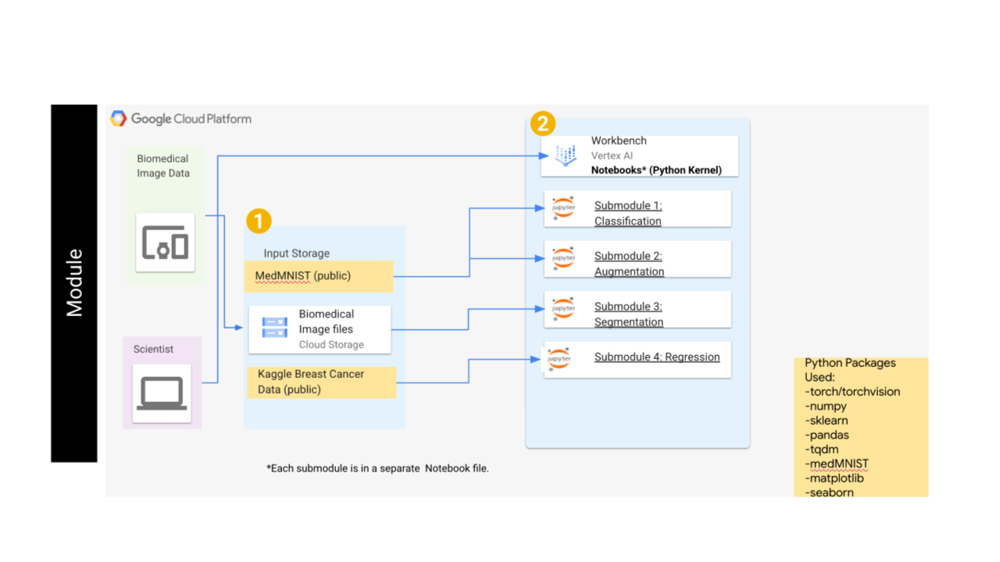
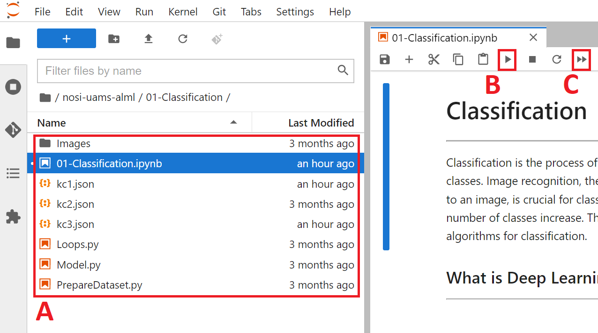

# Module Overview   
   
This module is broken up into four submodules:
    
01 - Classification

02 - Augmentation

03 - Segmentation

04 - Regression
    
Each submodule contains a "Jupyter notebook" that users will work through, all while discussing key scientific concepts along the way.

These submodules were designed to be used on cloud computing platforms, with the aim of requiring nothing but the files within the GitHub repository. 

Each of the submodules are created in `Python` and utilize the `PyTorch` library for deep learning. Each submodule also has additional libraries which are defined within the notebook(s) for each submodule. A general overview of this module can be found in Figure 1.
   

   
*Figure 1: The general architecture of this module, including the submodule names, datasets used in each submodule, and the python packages required.*
   
   

# Getting Started   
   
To create a virtual machine for GCP, follow steps 1-8 of [these instructions](https://github.com/STRIDES/NIHCloudLabGCP/blob/main/docs/vertexai.md) and be especially careful to enable idle shutdown as highlighted in step 7. When creating a virtual machine for this module, a kernel running PyTorch 1.13 is required. For this module, the `n1-standard-4` machine type will be sufficient. Additionally, a GPU is required for submodules 1-3 to substantially decrease network training times, and thus a single `NVIDIA T4` GPU is recommended. When selecting a GPU, you will also want to ensure that `Install NVIDIA GPU driver automatically for me` is checked.

Now that the virtual machine is created you will need to download the module. To clone this repository, use the Git command `git clone https://github.com/NIGMS/Biomedical-Imaging-Analysis-using-AI-ML-Approaches.git` in the dropdown menu option in Jupyter notebook. Please make sure you only enter the link for the repository that you want to clone. There are other bioinformatics related learning modules available in the [NIGMS Repository](https://github.com/NIGMS).
    
This will create a new folder called `Biomedical-Imaging-Analysis-using-AI-ML-Approaches`. This folder will contain all files within the module. 
   
    
# Running the Module   
   
After the module repository has been cloned, the different notebooks and data can be seen in the panel on the left (Figure 2A).  To run them you need only to double click the submodule you want. 
   

   
*Figure 2: The layout of a Jupyter notebook within the virtual machine. The current folder location (A), as well as the "Run selected" (B) and "Run all" (C) buttons are found on this page.*
   

   
It is recommended to run the submodules in a proper sequence as some of the concepts in the later submodules requires knowledge obtained in prior submodules. The recommended sequence and the main files are:

01-Classification.ipynb   
02-Augmentation.ipynb   
03-Segmentation.ipynb  
04-Regression.ipynb  

There may be multiple ".py" files within a submodule. The main ".ipynb" file is the only file that needs to be run, and the other ".py" files contain critical functions required for the submodule to work properly.

In some cases, while running the code, **warning** messages might appear. *Do not worry!* These messages appear because of in-built functions in Python libraries becoming outdated due to updates. These will not affect the submodules.

From here you can run each section, or **cell**, of the code, one by one, by pushing the `Play` button on the above menu (Figure 2B). To run all the cells at once push the double play button (Figure 2C).

Some **cells** of code may take longer for the computer to process than others. You will know a cell is running when a cell has an asterisk \[\*\] next to it. When the cell finishes running, that asterisk will be replaced with a number which represents the order that cell was run in. Some cells may produce an output that would appear when the code has stopped running. 

You can now explore the tutorials by running the code, from top to bottom. Within each notebook there might be exercises marked by a blue square that ask to re-run a cell by changing the parameters and observing the output. _Knowledge checks_, _Exercises_, and _Challenges_ are also present in each submodule marked by colored squares. These are for the user to test their knowledge of key scientific concepts within each notebook, and may require the user to modify code to successfully complete.