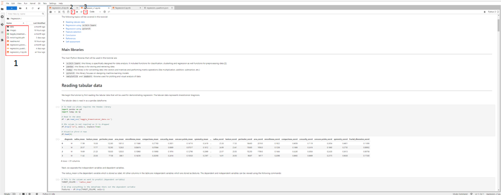

# Diving Into Deep Learning for Biomedical Data Analysis
# University of Arkansas, Fayetteville
---

Included here are four tutorials in the form of 'Jupyter notebooks'.

The purpose of these tutorials is to help users learn about machine learning and its applications in the specific context of bioinformatics. 

These tutorials cover the start to finish of basic bioinformatics analysis; starting from downloading raw sequence data and creating simple machine learning models to perform different tasks on biomedical data. 

The tutorial is divided into four sub-modules. Each of the sub-modules cover four main concepts in machine learning.

01-Classification  
02-Augmentation  
03-Segmentation  
04-Regression

# <a name="overview">Overview</a> 
---

* <a href="#requirements">Requirements</a> 
* <a href="#getting-started">Getting Started</a> 
* <a href="#exec">Tutorial Execution</a> 
* <a href="#data">Data</a> 
* <a href="#gloss">Glossary of Terms</a> 
 

# <a name="requirements">Requirements</a>
---

These tutorials were designed to be used on cloud computing platforms, with the aim of requiring nothing but the files within the github repository. 

Our tutorials use Jupyter Notebook files, which Google Cloud Platform, Amazon Web Service, and Microsoft Azure all provide support for. Therefore, requirements should only require creation of a virtual machine on one of these providers, and the downloading of this github's files to that machine.

Each of the sub-modules are created in Python. The necessary libraries to run the notebooks are defined within the notebooks. 

# <a name="getting-started">Getting Started</a>
---
To create a virtual machine for GCP, follow [these instructions](https://github.com/STRIDES/NIHCloudLabGCP/blob/main/docs/vertexai.md).
Now that the virtual machine is created, and are in the Jupyterlab screen, you can run our tutorial files. But first you will need to download them.
To clone our repository directly you will need to open a new terminal. 
Click the blue ``plus`` button on top left. This will open a new tab called ``launcher``. In the launcher select ``Terminal``. In the terminal copy and paste the following command:
`gcloud source repos clone nosi-uams-alml --project=nosi-uams-alml-e5a5`.
This will create a new folder called ``nosi-uams-alml``. This folder will contain all the necessary tutorial files. 

# <a name="exec">Tutorial Execution</a>
---

All our tutorial workflows are Jupyter format. The different notebooks and data can be seen in the panel on the left (shown as 1 in Figure 2).  To run them you need only to double click the tutorial file you want. 

It is recommended to run the files in a proper sequence as some of the concepts in the later notebooks requires knowledge obtained in prior notebooks. The recommended sequence and the main files are:

01-Classification.ipynb  
02-Augmentation.ipynb  
03-Segmentation.ipynb  
04-Regression.ipynb

The *.py* files contain the detailed description for the functions used in 01-Classification.ipynb and 02-Augmentation.ipynb.

In some cases, while running the code, **warning** messages might appear. *Do not worry!* These messages appear because of in-built functions in Python libraries becoming outdated due to updates. It will not affect the results.

The interface for Jupyter notebook can be seen in Figure 2.

From here you can run each section, or **cell**, of the code, one by one, by pushing the ``Play`` button on the above menu (shown as 2 in Figure 2). To run all the cells at once push the double play button (shown as 3 in Figure 2).

Some **cells** of code may take longer for the computer to process than others. You will know a cell is running when a cell has an asterisk \[\*\] next to it. When the cell finishes running, that asterisk will be replaced with a number which represents the order that cell was run in. Some cells may produce an output that would be appear when the code has stopped running. 

You can now explore the tutorials by running the code, from top to bottom. Within each notebook there might be exercises marked by a blue square that ask to re-run a cell by changing the parameters and observing the output. Knowledge checks are also present in each sub-module marked by a blue square. These contain multiple choice questions about the content found in the sub-module.

Jupyter is a powerful tool, with many useful features. For more information on how to use Jupyter, we recommend searching for Jupyter tutorials and literature online.

# <a name="data">Data</a>
---

These tutorials use image dataset mostly, except for the Regression sub-module that uses tabular dataset. The details of the dataset can be found in each of the sub-modules. For classification, augmentation and segmentation image dataset is used. For regression, tabular dataset is used.

# <a name="gloss">Glossary of terms</a> 
---

Here we define some of the terms that you may come across throughout the tutorial:

* **Machine Learning**: Machine learning (ML) is a field of artificial intelligence (AI) that builds methods that 'learn' and leverage data to improve performance on some set of tasks, like classification, regression, etc.

* **Neural Network (NN)**: A computer system modeled on the human brain and nervous system.

* **Deep Learning**: A type of machine learning based on artificial neural networks in which multiple layers of processing are used to extract progressively higher-level features from data.

* **Layer**: A layer is a building block of deep learning that takes in a weighted input and applies a function to obtain an output.

* **Convolutional Neural Network (NN)**: Convolutional neural networks are a specialized type of artificial neural networks that use a mathematical operation called convolution in place of general matrix multiplication in at least one of their layers. They are used in image recognition and processing.

* **Model**: A machine learning model is a program that has been trained to recognize certain types of patterns and find relationships between data. The model is trained over a set of data, providing it an algorithm that it can use to reason over and learn from those data. 

* **Train Data**: Seen data over which a machine learning model is trained.

* **Test Data**: Unseen data over which machine learning model performance is evaluated.

* **Validation Data**: Validation data is obtained from the training data and is used as part of the training process to reduce the bias in the model.

* **Tensor**: Tensors are multidimensional vectors.

* **Parameter**: A parameter is a configuration variable that is internal to the model and whose value can be estimated from data.

* **Hyperparameter**: Hyperparameter is a configuration that is external to the model and whose value cannot be estimated from data.

* **Epoch**: Epoch defines the number times that the learning algorithm will work through the entire training dataset.

* **Batch Size**: The batch size is the number of samples processed before the model is updated. The size of a batch must be more than or equal to one and less than or equal to the number of samples in the training dataset. Smaller batch sizes may cause the model to be less generalizable (overfitted) but large batch sizes are computationally more expensive and require more memory.
