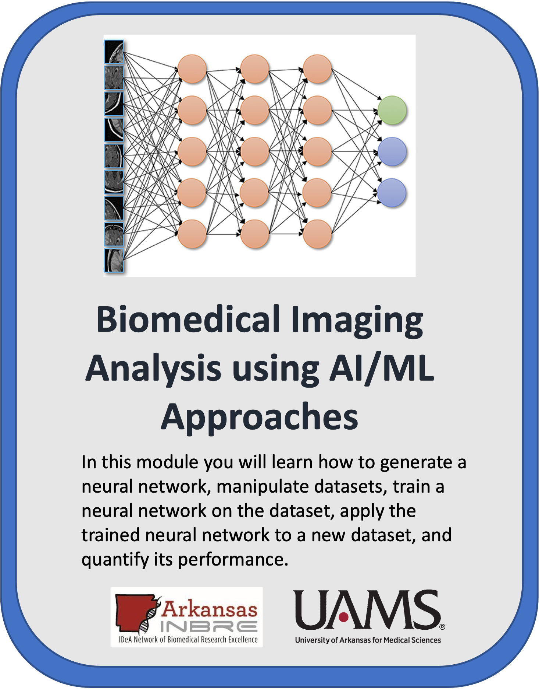
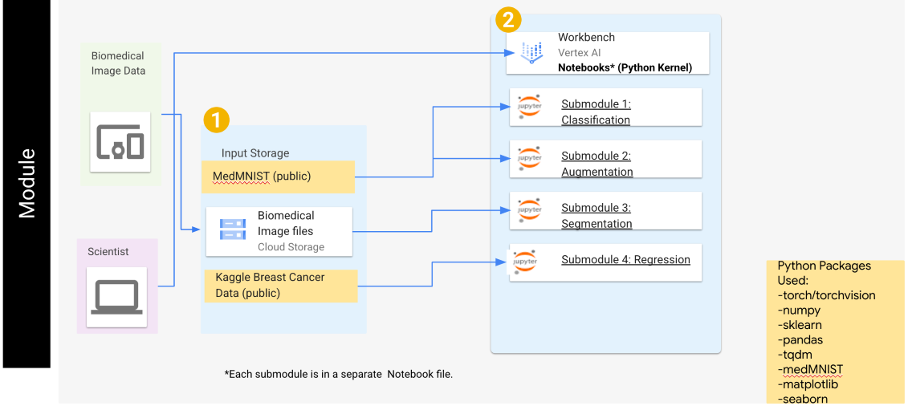
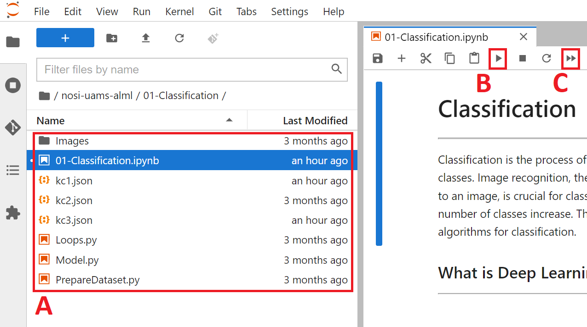
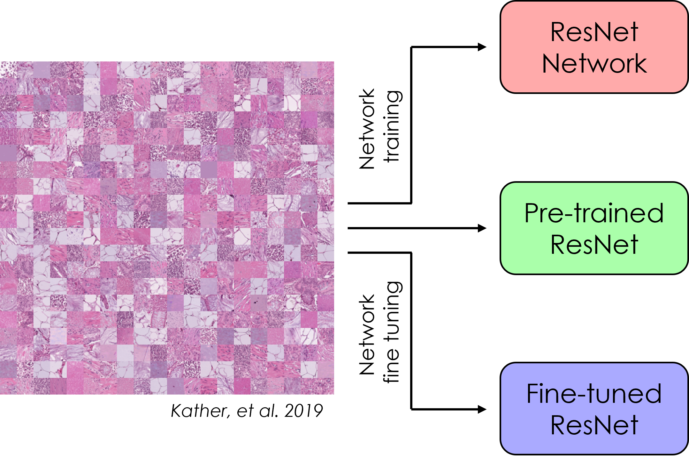
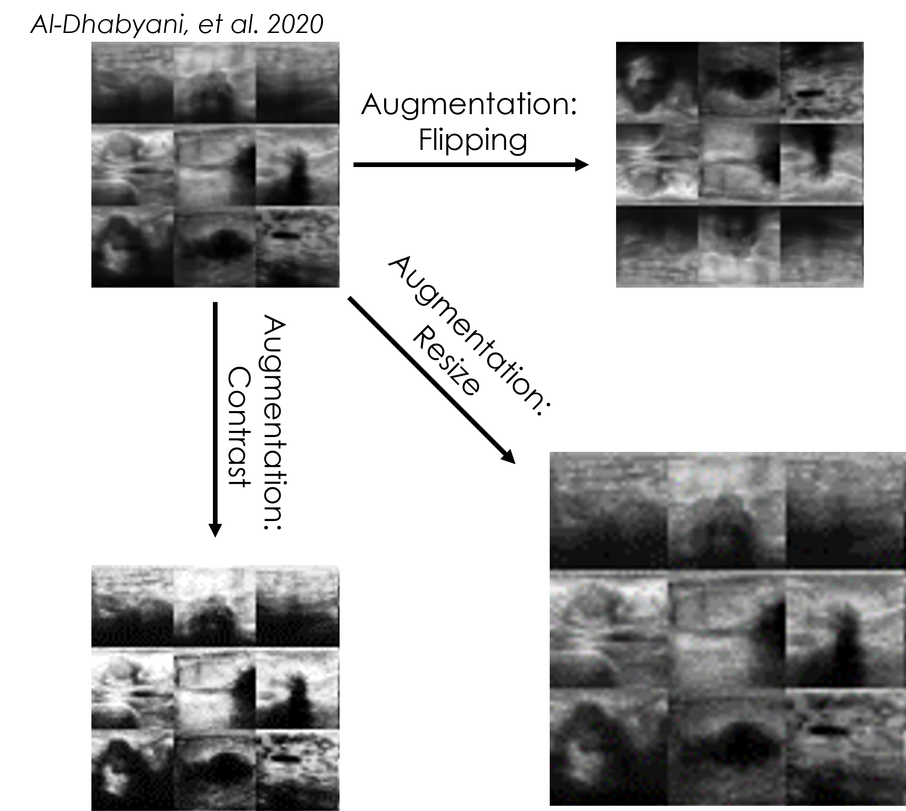
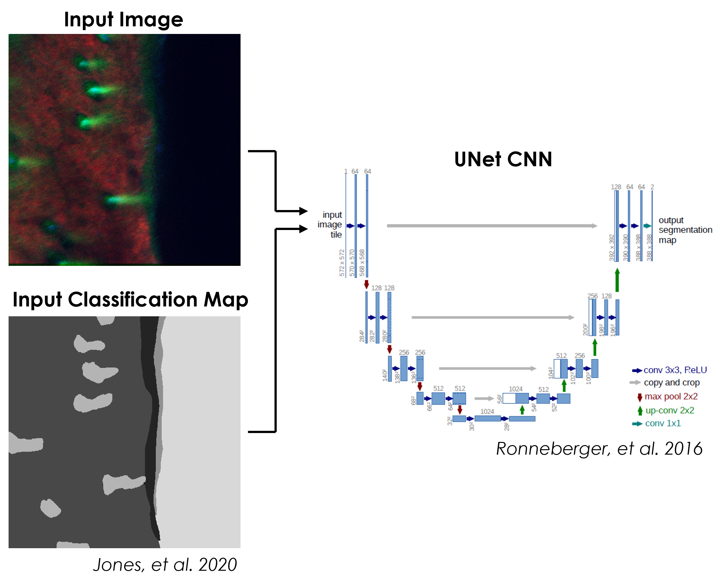
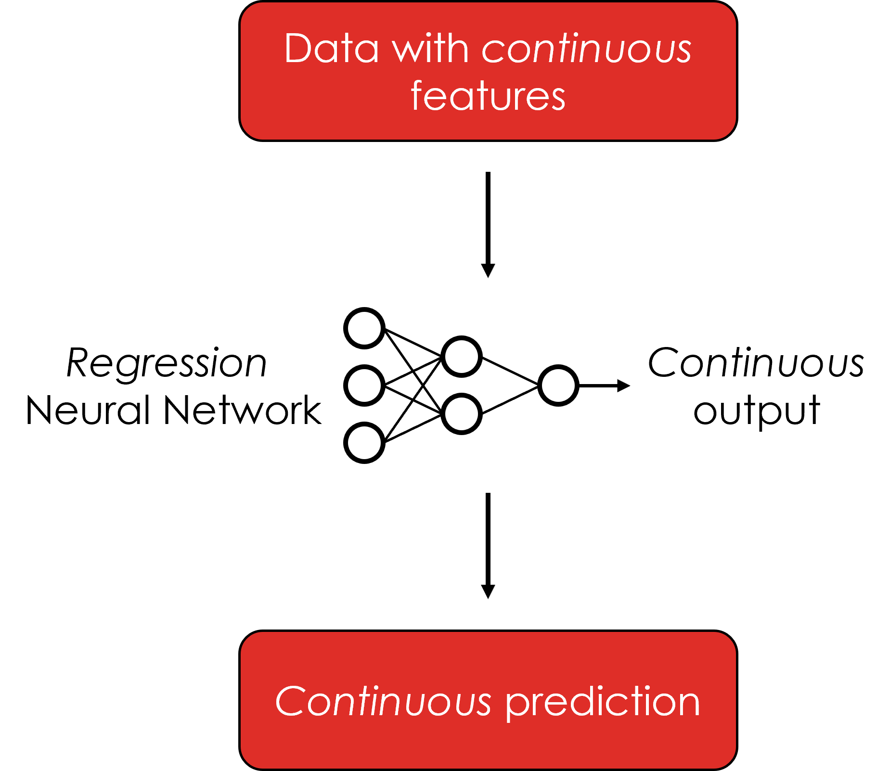

   
Image adapted from https://doi.org/10.3389/fneur.2019.00869

      
# Diving Into Deep Learning for Biomedical Data Analysis  
## University of Arkansas, Fayetteville  
   
   
   
# Table of Contents   

* [Introduction](#introduction)
* [Module Overview](#module-overview)
* [Getting Started](#getting-started)
* [Running the Module](#running-the-module)
* [Submodule Overview](#submodule-overview)
* [Glossary of Terms](#glossary-of-terms)
* [Acknowledgements](#acknowledgements)
   

   
# Introduction   
   
Data analysis and image processing is an important tool in biomedical engineering for identifying biologically relevant patterns within collected data. Although there are many well-established practices when it comes to data analysis, the ability to resolve important patterns hidden with data is limited by the knowledge of the researchers. Additionally, the identified patterns are highly susceptible to implicit biases contained within the data. Due to these limitations, there is a need for more advanced data analysis tools that can recognize the patterns and allow the researchers to accurately identify the biologically relevant patterns.   

_Artificial intelligence_ (AI), which is defined as the simulation of human intelligence by computers, is a cutting edge tool in data analysis that allows for computers to identify patterns within data. Within AI, there are many different fields of research including _computer vision_, _machine learning_, and _deep learning_. Specifically, _deep learning_ refers to the utilization of a _neural network_ to identify and classify complex patterns within multidimensional data (e.g., images, tabular data, database records, etc.). Implementation of neural networks is not limited to scientific research, however, and can be found in everyday use. Some common example of  _neural networks_ in action are:

* ChatGPT
* DALL-E 2
* Home assistants (Amazon Alexa, Google Assistant, etc.)
* Self-driving cars
    
In practice, a neural network first needs to undergo _training_, where the network incrementally learns patterns based on a relatively large collection of data. After training the network, it can then be deployed and _predict_ the learned patterns on data that it has not seen before. These _training_ and _prediction_ phases make neural networks a highly versatile tool that can be utilized in many engineering disciplines to achieve various tasks. Some examples of neural networks currently being used in biomedical engineering include:

* Cancer detection
* Cell and tissue segmentation
* Particle tracking
* Bioinformatics
    
In this module, you will learn the basic "ins" and "outs" of neural networks, including generating a neural network, manipulating datasets, training a neural network on the dataset, applying the trained neural network to a new dataset, and quantifying its performance.

This whole module will cost you about $1.00 to run, assuming you tear down all resources upon completion.
    
Watch this [Introduction Video](https://youtu.be/-5GHSZABDLk) to learn more about the module.
   
   

# Module Overview   
   
This module is broken up into four submodules:
    
01 - Classification

02 - Augmentation

03 - Segmentation

04 - Regression
    
Each submodule contains a "Jupyter notebook" that users will work through, all while discussing key scientific concepts along the way.

These submodules were designed to be used on cloud computing platforms, with the aim of requiring nothing but the files within the GitHub repository. 

Each of the submodules are created in `Python` and utilize the `PyTorch` library for deep learning. Each submodule also has additional libraries which are defined within the notebook(s) for each submodule. A general overview of this module can be found in Figure 1.
   

   
*Figure 1: The general architecture of this module, including the submodule names, datasets used in each submodule, and the python packages required.*
   
   

# Getting Started   
   
To create a virtual machine for GCP, follow [these instructions](https://github.com/STRIDES/NIHCloudLabGCP/blob/main/docs/vertexai.md). When creating a virtual machine for this module, a kernel running PyTorch 1.13 is required. For this module, the `n1-standard-4` machine type will be sufficient. Additionally, a GPU is required for submodules 1-3 to substantially decrease network training times, and thus a single `NVIDIA T4` GPU is recommended. When selecting a GPU, you will also want to ensure that `Install NVIDIA GPU driver automatically for me` is checked.

Now that the virtual machine is created, and are in the Jupyterlab screen, you can run the submodules. But first you will need to download them.
To clone our repository directly you will need to open a new terminal. 
Click the blue `plus` button on top left. This will open a new tab called `launcher`. In the launcher select `Terminal`. In the terminal copy and paste the following command:
`git clone https://github.com/NIGMS/Biomedical-Imaging-Analysis-using-AI-ML-Approaches.git`
    
This will create a new folder called `MachineLearningUA`. This folder will contain all files within the module. 
   
   
    
# Running the Module   
   
After the module repository has been cloned, the different notebooks and data can be seen in the panel on the left (Figure 2A).  To run them you need only to double click the submodule you want. 
   

   
*Figure 2: The layout of a Jupyter notebook within the virtual machine. The current folder location (A), as well as the "Run selected" (B) and "Run all" (C) buttons are found on this page.*
   

   
It is recommended to run the submodules in a proper sequence as some of the concepts in the later submodules requires knowledge obtained in prior submodules. The recommended sequence and the main files are:

01-Classification.ipynb   
02-Augmentation.ipynb   
03-Segmentation.ipynb  
04-Regression.ipynb  

There may be multiple ".py" files within a submodule. The main ".ipynb" file is the only file that needs to be run, and the other ".py" files contain critical functions required for the submodule to work properly.

In some cases, while running the code, **warning** messages might appear. *Do not worry!* These messages appear because of in-built functions in Python libraries becoming outdated due to updates. These will not affect the submodules.

From here you can run each section, or **cell**, of the code, one by one, by pushing the `Play` button on the above menu (Figure 2B). To run all the cells at once push the double play button (Figure 2C).

Some **cells** of code may take longer for the computer to process than others. You will know a cell is running when a cell has an asterisk \[\*\] next to it. When the cell finishes running, that asterisk will be replaced with a number which represents the order that cell was run in. Some cells may produce an output that would appear when the code has stopped running. 

You can now explore the tutorials by running the code, from top to bottom. Within each notebook there might be exercises marked by a blue square that ask to re-run a cell by changing the parameters and observing the output. _Knowledge checks_, _Exercises_, and _Challenges_ are also present in each submodule marked by colored squares. These are for the user to test their knowledge of key scientific concepts within each notebook, and may require the user to modify code to successfully complete.
   
   

# Submodule Overview   

## Submodule 1: Classification   

   
Convolutional neural networks (CNNs) are a powerful deep learning tool that allows for classification of images based on features contained with the image. For more complex network architectures, pre-trained models are available for use, and can be fine tuned using transfer learning. In this submodule, a specific CNN architecture (ResNet) is created from scratch and trained on the PathMNIST dataset. Next, a pre-trained version of ResNet is used to classify the same dataset, and then the network is fine tuned via transfer learning. Finally, the accuracy of each model is compared to determine the best model for this application.

   
   

## Submodule 2: Augmentation   

   
Although CNNs are very powerful tools for detecting features in images, image transformations such as rotation will cause a decrease in prediction accuracy. Sometimes there is not enough training data to cover all these variations. To increase robustness, networks can be trained on an augmented dataset that has additional images created from the originals using scaling, rotation, cropping, etc. In this submodule, multiple ResNet CNNs are trained using the BreastMNIST dataset and the network accuracy from each CNN is then compared.

   
   

## Submodule 3: Segmentation   

  
Typical CNNs output a single classification for an entire input image, which is not ideal for images the contain instances of multiple classes distributed spatially. A special type of CNN architecture can be used to produce a pixel-wise classification map, in a process called segmentation, for an input image. In this submodule, a UNet CNN is used to segment images of skin into classification maps based on the surrounding signal. The accuracy of the network is measured, and the classification maps produced by the trained network are visualized. 

   
   

## Submodule 4: Regression   

   
Classification is a powerful tool for biomedical image analysis. By default, CNNs output category labels for input images, which may not be as fine-grained as needed. CNNs can also be trained to output continuous values by switching the training regimen from classification to regression. In this submodule, a simple regression model is trained on a tabular breast cancer dataset. The trained model is then used to predict a continuous cancer radius value, based on multiple features within the data.

   
   

# Glossary of Terms   
   

Here we define some of the terms that you may come across throughout the tutorial:

* **Machine Learning**: Machine learning (ML) is a field of artificial intelligence (AI) that builds methods that 'learn' and leverage data to improve performance on some set of tasks, like classification, regression, etc.

* **Neural Network (NN)**: A computer system modeled on the human brain and nervous system.

* **Deep Learning**: A type of machine learning based on artificial neural networks in which multiple layers of processing are used to extract progressively higher-level features from data.

* **Layer**: A layer is a building block of deep learning that takes in a weighted input and applies a function to obtain an output.

* **Convolutional Neural Network (CNN)**: Convolutional neural networks are a specialized type of artificial neural networks that use a mathematical operation called convolution in place of general matrix multiplication in at least one of their layers. They are used in image recognition and processing.

* **Model**: A machine learning model is a program that has been trained to recognize certain types of patterns and find relationships between data. The model is trained over a set of data, providing it an algorithm that it can use to reason over and learn from those data. 

* **Train Data**: Seen data over which a machine learning model is trained.

* **Test Data**: Unseen data over which machine learning model performance is evaluated.

* **Validation Data**: Data that is obtained from the training data and is used as part of the training process to reduce the bias in the model.

* **Tensor**: A multidimensional vector.

* **Parameter**: A configuration variable that is internal to the model and whose value can be estimated from data.

* **Hyperparameter**: A configuration that is external to the model and whose value cannot be estimated from data.

* **Epoch**: The number times that the learning algorithm will work through the entire training dataset.

* **Batch Size**: The number of samples processed before the model is updated. The size of a batch must be more than or equal to one and less than or equal to the number of samples in the training dataset. Smaller batch sizes may cause the model to be less generalizable (overfitted) but large batch sizes are computationally more expensive and require more memory.
   
   
 
# Acknowledgements   
  
We would like to acknowledge the following funding sources for their continued support:
    
* 3P20GM103429-21S2
* R01AG056560
* R01EB031032
* P20GM139768
    
   
   
Additionally, we would like to thank all of the principal investigators, students, and personnel involved with this project.

## **License for Data**

Text and materials are licensed under a Creative Commons CC-BY-NC-SA license. The license allows you to copy, remix and redistribute any of our publicly available materials, under the condition that you attribute the work (details in the license) and do not make profits from it. More information is available [here](https://tilburgsciencehub.com/about/#license).

This work is licensed under a [Creative Commons Attribution-NonCommercial-ShareAlike 4.0 International License](http://creativecommons.org/licenses/by-nc-sa/4.0/)

